# Aerial Robotics Laboratory - Hands-on Assignments

> **Course:** Advanced Topics in Automation and Control Engineering - *Aerial Robotics Laboratory*
> **Institution:** Politecnico di Milano, 2025–26
> **Lecturers:** Dr. Marco Tognon, Dr. Gianluca Corsini - *RAINBOW Team, Inria / IRISA / Université de Rennes*

This repository contains my implementations for the 6 lab assignments that make up the Aerial Robotics
Laboratory module of the *Advanced Topics in Automation and Control Engineering* course. Each assignment
explores a different layer of an aerial robot's software stack - from rigid-body modelling and trajectory
generation, through state estimation and motion control, all the way to physical interaction with the
environment via an admittance filter and a wrench observer.

The work is built on top of the [**`telekyb3`**](https://git.openrobots.org/projects/telekyb3) framework, an
open-source collection of GenoM3 components for multi-rotor UAVs developed by **LAAS-CNRS, IRISA-Inria,
University of Twente** and **University College London**. All control / estimation / interaction
components used here (`uavpos-genom3`, `uavatt-genom3`, `nhfc-genom3`, `pom-genom3`, `optitrack-genom3`,
`rotorcraft-genom3`, `maneuver-genom3`, `phynt-genom3`, `mrsim-gazebo`) are part of `telekyb3` - full credit
for their design and implementation goes to the original authors and to the
[RAINBOW team](https://team.inria.fr/rainbow/).

## Showcase - Assignment 6a: Physical Interaction in Gazebo

Final assignment: a fully-actuated tilted hexarotor (TiltHex) equipped with a 0.6 m carbon-fiber
end-effector slides along a 1 m square pattern on a static thin wall, with contact forces shaped by an
**admittance filter** and a **wrench observer** (`phynt-genom3`).

https://github.com/user-attachments/assets/128ed5de-2f88-4ef9-a5f8-4a10dfc13c03

---

## Table of Contents

1. [Framework & background](#framework--background)
2. [Repository layout](#repository-layout)
3. [Setup - running everything inside the `tk3lab` Docker image](#setup--running-everything-inside-the-tk3lab-docker-image)
4. [Assignments](#assignments)
   - [1a - Quadrotor in Gazebo](#1a--quadrotor-in-gazebo)
   - [1b - Under-actuated hexarotor in Gazebo](#1b--under-actuated-hexarotor-in-gazebo)
   - [1c - Fully-actuated hexarotor (TiltHex) in Gazebo](#1c--fully-actuated-hexarotor-tilthex-in-gazebo)
   - [2b - Standalone rigid-body simulator](#2b--standalone-rigid-body-simulator)
   - [2c - Simulator + nhfc controller](#2c--simulator--nhfc-controller)
   - [3a - Kinematic trajectory generation (`maneuver-genom3`)](#3a--kinematic-trajectory-generation-maneuver-genom3)
   - [3b - Polynomial trajectories with full derivative chain](#3b--polynomial-trajectories-with-full-derivative-chain)
   - [4 - State estimation with `pom-genom3`](#4--state-estimation-with-pom-genom3)
   - [5a - Motion control with `uavpos`/`uavatt`](#5a--motion-control-with-uavposuavatt)
   - [5b - Motion control with a custom Python feedback-linearization controller](#5b--motion-control-with-a-custom-python-feedback-linearization-controller)
   - [6a - Physical interaction with a wall](#6a--physical-interaction-with-a-wall)
5. [Acknowledgments](#acknowledgments)
6. [References](#references)

---

## Framework & background

The lab assignments use the following open-source robotics stack, all developed primarily at
LAAS-CNRS / IRISA-Inria:

| Component | Purpose | Reference |
|---|---|---|
| [`telekyb3`](https://git.openrobots.org/projects/telekyb3) | Modular software framework for multi-rotor UAVs | open-source, LAAS-CNRS / IRISA-Inria / Twente / UCL |
| [GenoM3](https://www.openrobots.org/wiki/genom3) | Real-time component-based middleware abstraction | LAAS-CNRS, Anthony Mallet |
| [robotpkg](http://robotpkg.openrobots.org/) | Source-based package manager for robotics software | LAAS-CNRS |
| [Gazebo](https://gazebosim.org/) | 3-D physics simulator | Open Source Robotics Foundation |
| [SDFormat](https://sdformat.org/) | XML format used to describe Gazebo robots / worlds | OSRF |
| [Genomix](https://git.openrobots.org/projects/genomix) | HTTP/JSON bridge that lets Python clients call GenoM3 services | LAAS-CNRS |
| [`mrsim-gazebo`](https://git.openrobots.org/projects/mrsim-gazebo) | Multi-rotor Gazebo plugin (motors + IMU) | LAAS-CNRS |
| [`optitrack-gazebo`](https://git.openrobots.org/projects/optitrack-gazebo) | Mocap simulation plugin | LAAS-CNRS |

The GenoM3 components used directly in this repository - every `<name>-genom3` referenced below - are part
of the `telekyb3` collection. Their full documentation lives at
`https://git.openrobots.org/projects/<name>-genom3/pages/README`. None of them was implemented by me -
my work is to *use* and *parameterise* them through Python clients, plus to write the dynamics simulators,
custom controllers, plotting, and SDF model edits required by each assignment.

### High-level architecture

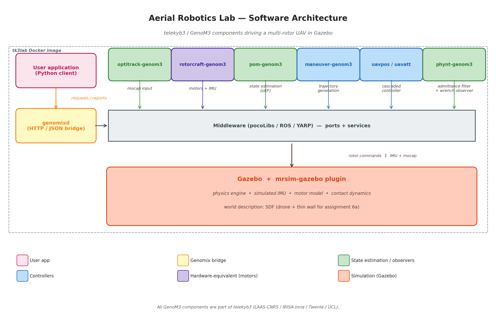

User Python clients drive [`genomixd`](https://git.openrobots.org/projects/genomix) over HTTP/JSON.
`genomixd` exposes the full set of `telekyb3` GenoM3 components (state estimation, controllers, observers,
trajectory generator) sitting on a real-time middleware bus. The bottom layer is Gazebo with the
`mrsim-gazebo` plugin, which provides the simulated motors, IMU, and contact dynamics - the equivalent
of the real flight controller / ESC / IMU stack on the physical platform.

---

## Repository layout

```
tk3lab-ws/
├── 6a_physical_interaction_recording.webm   ← demo video (top of this README)
├── README.md                                ← personal notes (kept locally)
├── README_GITHUB.md                         ← this file
├── gazebo/
│   ├── models/
│   │   ├── mrsim-hexa-ua/                   ← under-actuated hexa SDF
│   │   └── mrsim-tilthex/                   ← fully-actuated hexa SDF (with EE bar for 6a)
│   └── worlds/
│       ├── hexa-ua-world.world              ← hexa-UA + ground
│       └── hexa-fa-wall-world.world         ← hexa-FA + thin static wall (assignment 6a)
├── logs/                                    ← runtime logs (auto-populated)
└── src/
    ├── 01-intro/                            ← assignment 1a/b/c - Gazebo intro
    ├── 02b-model/                           ← assignment 2b - standalone rigid-body sim
    ├── 02c-model/                           ← assignment 2c - sim + nhfc
    ├── 03a-trajectory/                      ← assignment 3a - kinematic trajectories
    ├── 03b-trajectory/                      ← assignment 3b - polynomial trajectories
    ├── 04-state-estimation/                 ← assignment 4 - state estimation
    ├── 05a-motion-control/                  ← assignment 5a - uavpos / uavatt
    ├── 05b-motion-control/                  ← assignment 5b - custom Python FB-lin
    └── 06a-physical-interaction/            ← assignment 6a - phynt + wall
```

Every assignment folder contains a `simulation.sh` (which spawns the required GenoM3 components, and
optionally Gazebo), one or more Python clients that drive the components, and a plotting script that
post-processes the recorded data.

---

## Setup - running everything inside the `tk3lab` Docker image

The lab is distributed as a Docker image (`tk3lab`) provided by the lecturers. It bundles `telekyb3`,
Gazebo (Ionic), GenoM3, all components above, and a noVNC desktop accessible from a browser.

```bash
# (host) load + run the image
cd ~/tk3lab/releases/r-1.3/scripts
sh tk3lab-load ~/tk3lab/docker-images/dimg-0.2/tk3lab-ionic-0.2.tar.gz
sh tk3lab-run -g ionic -v 0.2

# open http://localhost:6080 in any browser → Linux desktop
# the workspace at /shared-workspace inside the container is the host's ~/tk3lab-ws/
```

Two Docker terminals are typically used:
- **Terminal 1** runs `simulation.sh` (Gazebo + components).
- **Terminal 2** runs the Python client that drives the simulation.
Plots are produced *outside* the container, on the host PC, since matplotlib in noVNC is slow.

---

## Assignments

> Each assignment expects two terminals inside the Docker desktop (T1 / T2) and a third one on the host (H)
> for plotting. Detailed run instructions are repeated in each section.

### 1a - Quadrotor in Gazebo

A pre-existing world (`/opt/openrobots/share/gazebo/worlds/example.world`) is launched with
`mrsim-gazebo`, `pom-genom3`, `optitrack-gazebo`, `rotorcraft-genom3`, and `nhfc-genom3` wired together.
The Python client moves the quadrotor through 3 waypoints. The goal of this assignment is to get familiar
with the full GenoM3 stack used in every later assignment.

```bash
# T1
cd /shared-workspace/src/01-intro && sh tk3-quadrotor-simulation.sh
# T2
cd /shared-workspace/src/01-intro && python3 -i tk3-quadrotor-control.py
>>> simulation()
# H
python3 plot_gazebo.py   # LOG_DIR points at logs/01-intro/quad
```

### 1b - Under-actuated hexarotor in Gazebo

Same as 1a but with a 6-rotor under-actuated platform (`mrsim-hexa-ua` SDF, no propeller tilt) and a custom
world (`hexa-ua-world.world`). `nhfc-genom3` is re-tuned for the heavier hexa frame.

```bash
# T1
cd /shared-workspace/src/01-intro && sh tk3-hexa-ua-simulation.sh
# T2
cd /shared-workspace/src/01-intro && python3 -i tk3-hexarotor-ua-control.py
>>> simulation()
```

### 1c - Fully-actuated hexarotor (TiltHex) in Gazebo

Same software stack as 1b but with the `mrsim-tilthex` SDF - rotors are tilted ±21° / ±18° so the
platform can produce non-zero lateral force/moment without changing attitude. Demonstrates that `nhfc`
also handles the fully-actuated case (with appropriate gains).

```bash
# T1: re-uses the under-actuated launcher (Gazebo world identical)
cd /shared-workspace/src/01-intro && sh tk3-hexa-ua-simulation.sh
# T2
cd /shared-workspace/src/01-intro && python3 -i tk3-hexarotor-fa-control.py
>>> simulation()
```

### 2b - Standalone rigid-body simulator

Pure Python implementation of the multi-rotor rigid-body equations of motion (Newton–Euler) integrated
with RK4. No GenoM3 / Gazebo. Compares two thrust regimes:
1. `thrust = m·g` (perfect hover)
2. `thrust = m·g + 1 N` (small unbalance → climb).

This isolates the dynamics layer from everything else so we can reason about it in pure Python.

```bash
# H (no Docker needed)
cd src/02b-model && python3 model.py
```

#### Plots

| `thrust = mg` (hover) | `thrust = mg + 1N` (climb) |
|---|---|
| 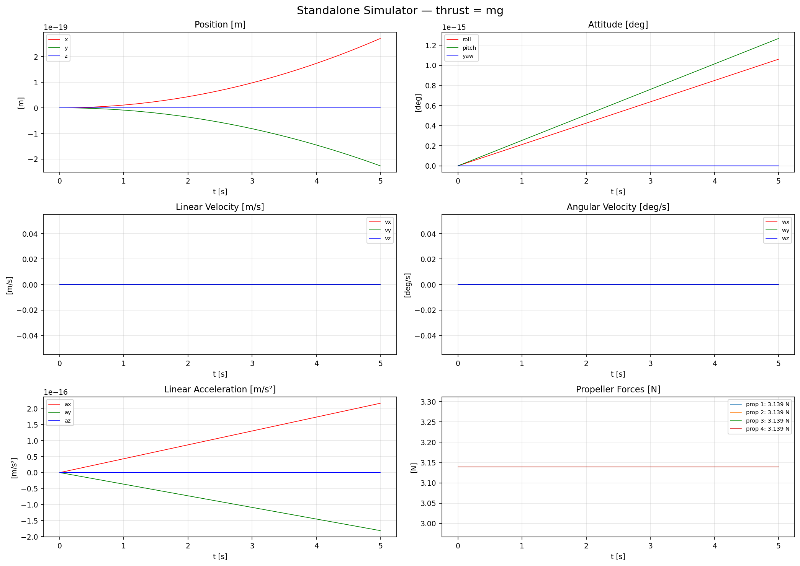 | 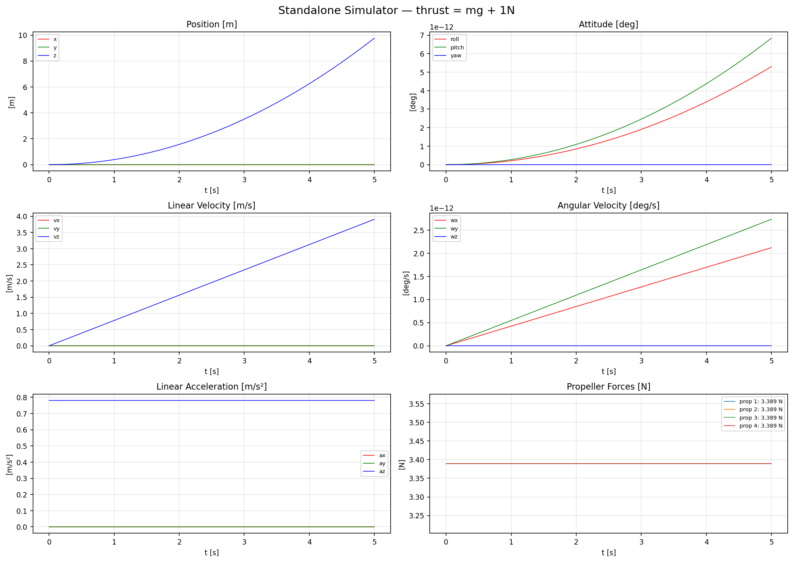 |

### 2c - Simulator + nhfc controller

The standalone Python simulator from 2b is wired to the real `nhfc-genom3` controller through the GenoM3
`state` and `rotor_input` ports. The Python loop publishes the simulated state at 1 kHz, reads the
controller's rotor commands, and steps the dynamics.

```bash
# T1
cd /shared-workspace/src/02c-model && sh simulation.sh   # only nhfc
# T2
cd /shared-workspace/src/02c-model && python3 -i model.py
# H
python3 plot_02c.py
```

#### Plot

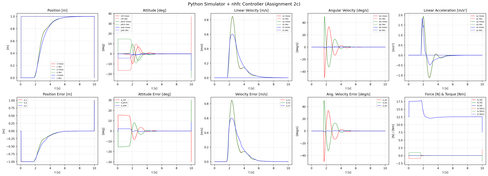

### 3a - Kinematic trajectory generation (`maneuver-genom3`)

Adds [`maneuver-genom3`](https://git.openrobots.org/projects/maneuver-genom3) to the chain - a kinematic
trajectory generator that produces position + velocity + acceleration + jerk + snap references compatible
with `nhfc`'s `or_rigid_body::state` reference port. The user calls `maneuver.goto(x, y, z, yaw, T)`.

Three robots are exercised in identical Python sims: quadrotor, hexa-UA, hexa-FA.

```bash
# T1
cd /shared-workspace/src/03a-trajectory && sh simulation.sh
# T2 (one of)
python3 -i model_quad.py
python3 -i model_hexa_ua.py
python3 -i model_hexa_fa.py
# H
python3 plot_03a.py {quad|hexa-ua|hexa-fa}
```

#### Plots

| Quadrotor | Hexa-UA | Hexa-FA |
|---|---|---|
| 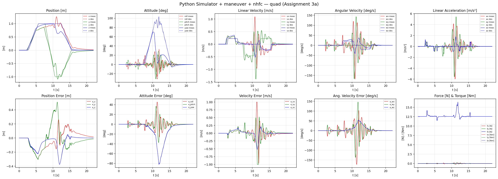 | 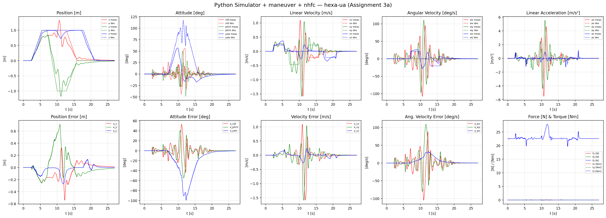 | 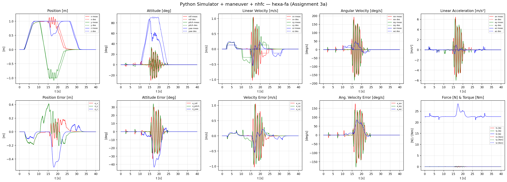 |

### 3b - Polynomial trajectories with full derivative chain

Drops `maneuver-genom3` and instead writes a quintic-polynomial trajectory generator in Python that fills
*all* state derivatives up to snap, matching the `or_rigid_body::state` schema:

```
q(t)  = c0 + c1·t + c2·t² + c3·t³ + c4·t⁴ + c5·t⁵
vel   = q'(t)        ← used by nhfc PD damping
acc   = q''(t)       ← thrust feedforward
jerk  = q'''(t)      ← attitude feedforward
snap  = q''''(t)     ← motor torque feedforward
```

Without `jerk` and `snap` populated the inner loop loses its feedforward terms and tracking degrades
significantly - verified empirically.

```bash
# T1
cd /shared-workspace/src/03b-trajectory && sh simulation.sh
# T2
python3 -i model_{quad|hexa_ua|hexa_fa}.py
# H
python3 plot_03b.py {quad|hexa-ua|hexa-fa}
```

#### Plots

| Quadrotor | Hexa-UA | Hexa-FA |
|---|---|---|
| 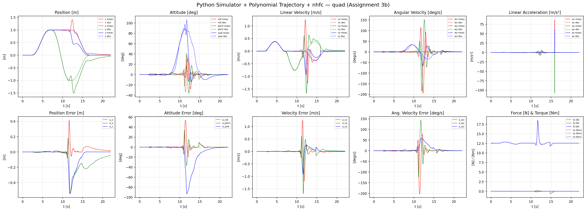 | 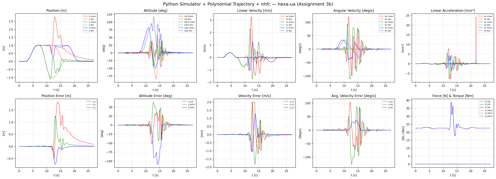 | 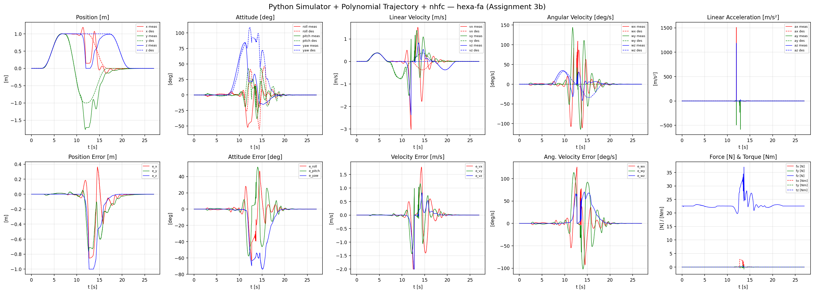 |

### 4 - State estimation with `pom-genom3`

Runs an end-to-end Gazebo simulation (`mrsim-gazebo` + `optitrack-gazebo` + `rotorcraft-genom3`) and feeds
the noisy IMU and mocap measurements through [`pom-genom3`](https://git.openrobots.org/projects/pom-genom3)
- an Unscented Kalman Filter that fuses IMU + magnetometer + mocap. Five noise/availability configurations
are compared (baseline, GPS+mag at 10× noise, 100× noise, IMU-only at 10× noise, IMU-only at 100× noise).

```bash
# T1
cd /shared-workspace/src/04-state-estimation && sh simulation.sh
# T2
python3 state_estimation.py <config-name>
# H
python3 plot_04.py [configs...]
```

#### Plots

| State comparison (all configs) | Variance comparison (all configs) |
|---|---|
| 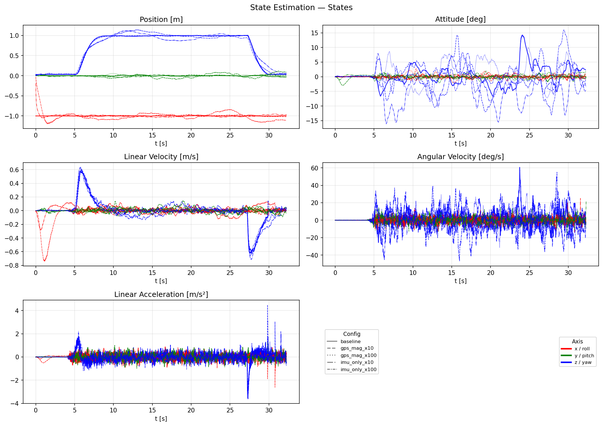 | 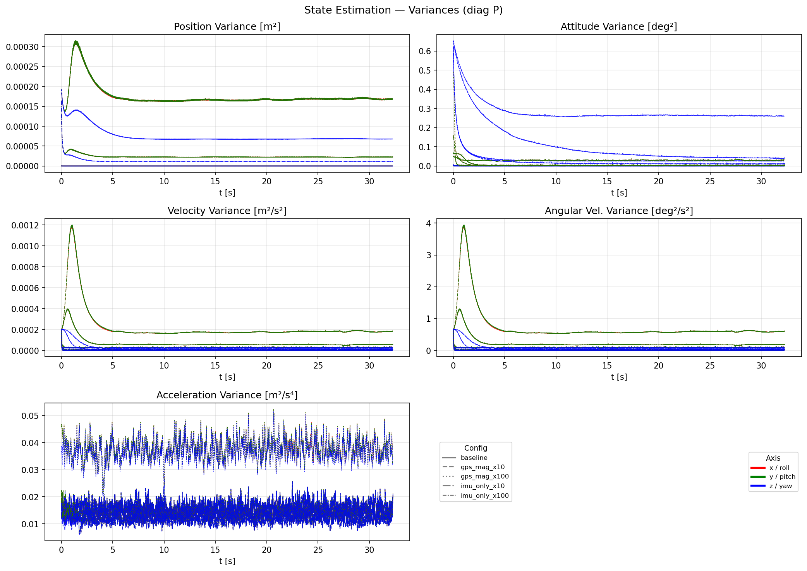 |

### 5a - Motion control with `uavpos`/`uavatt`

Replaces `nhfc-genom3` with the cascaded
[`uavpos-genom3`](https://git.openrobots.org/projects/uavpos-genom3) /
[`uavatt-genom3`](https://git.openrobots.org/projects/uavatt-genom3) pair, which is tailored for
**fully-actuated** platforms (it explicitly accounts for bounded lateral force capability). Tracking and
control wrenches are compared against the equivalent `nhfc` baseline from 03a.

```bash
# T1
cd /shared-workspace/src/05a-motion-control && sh simulation.sh
# T2
python3 -i model_hexa_fa.py
# H
python3 plot_05a.py [compare]
```

#### Plots

| Tracking - uavpos/uavatt vs nhfc | Wrench |
|---|---|
| 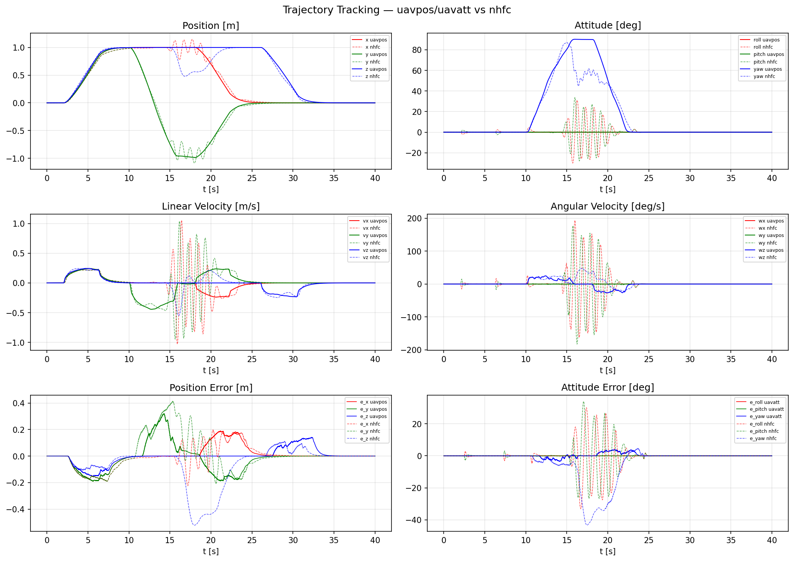 | 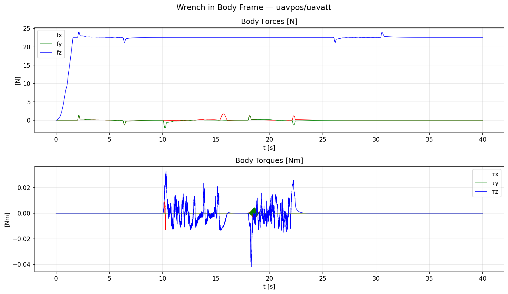 |

### 5b - Motion control with a custom Python feedback-linearization controller

Implements a feedback-linearization controller from scratch in Python, using the same dynamics simulator
as in 03a/05a, and benchmarks it against both `nhfc` (03a) and `uavpos`/`uavatt` (05a). Demonstrates that
a textbook FB-lin design produces similar tracking once velocity feedforward is included, but at the cost
of writing every term ourselves.

```bash
# T1
cd /shared-workspace/src/05b-motion-control && sh simulation.sh
# T2
python3 -i model_hexa_fa.py
# H
python3 plot_05b.py [compare]
```

#### Plots

| Tracking - Python FB-lin vs nhfc vs uavpos/uavatt | Wrench |
|---|---|
| 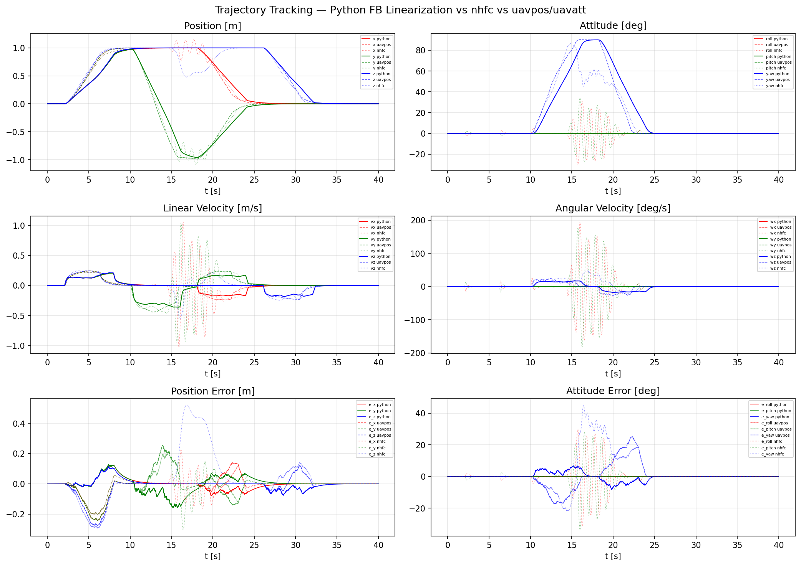 | 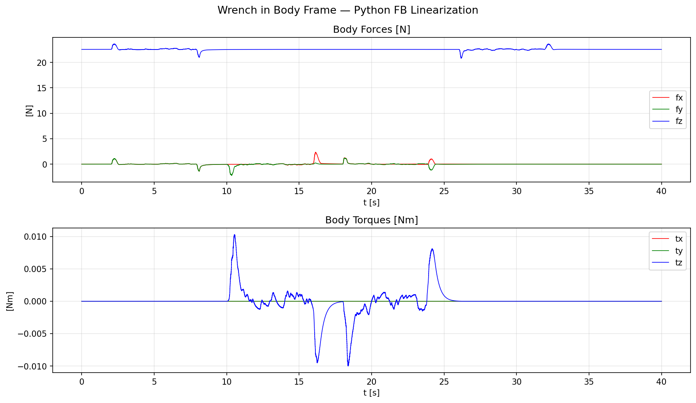 |

### 6a - Physical interaction with a wall

The capstone assignment. A fully-actuated hexarotor equipped with an L-shaped end-effector (a vertical bar
dropping from the drone disk's centre, then a horizontal bar along the body x-axis with a sphere tip) is
tasked with making controlled contact with a thin static wall and sliding the tip along a 1 m square
path.

The interaction is mediated by [`phynt-genom3`](https://git.openrobots.org/projects/phynt-genom3), which
implements:

- a **wrench observer (WO)** that estimates the external wrench from the (known) rotor wrench and the
  measured drone state, following Tomić, Ott & Haddadin's design ([IEEE T-RO 2017](https://ieeexplore.ieee.org/document/8049322));
- an **admittance filter (AF)** that turns the maneuver-generated nominal trajectory into a compliant
  reference (mass–spring–damper response to the estimated wrench).

The full chain is:

```
maneuver/desired ──> phynt/reference ──> phynt/desired ──> uavpos/reference ──> uavatt/uav_input
                          │                                                          │
                          └─ wrench_measure <── uavatt/wrench_measure                 ▼
                                                                                  rotorcraft
                                                                                      │
                                                                                      ▼
                                                                                  Gazebo
                                                                                  (mrsim)
```

#### World, model and parameters

- **World:** `gazebo/worlds/hexa-fa-wall-world.world` - drops a 4 × 4 m static box at x = 2.0 m, 2 cm
  thick, with low Coulomb friction (μ = 0.3) and Gazebo contact compliance (kp = 500, kd = 50).
- **Drone SDF:** `gazebo/models/mrsim-tilthex/model.sdf` - vanilla `mrsim-tilthex` extended with a
  vertical 0.10 m bar and a horizontal 0.6 m bar (purple) ending in a black sphere tip (radius 0.05 m).
- **AF:** `af_K = [10, 100, 100, 50, 50, 50]` N/m  (lab requirement: *1 N for every 10 cm of nominal
  position deviation* in the contact direction).
- **WO:** `K = [1, 1, 1, 0, 0, 0]`, `fc = [20, 20, 20, 1, 1, 1]` (force part: lecturer's defaults; torque
  part disabled because the integral form drifts under our discrete-time pipeline).
- **Effective drone mass:** 2.72 kg (= 2.3 kg base + 6 × 0.07 kg per `mrsim-rotor`) - recovered from the
  hover-thrust log; an incorrect value here causes the drone to under-thrust and never reach the wall.

#### How to run

```bash
# T1
cd /shared-workspace/src/06a-physical-interaction && sh simulation.sh
# T2
cd /shared-workspace/src/06a-physical-interaction
python3 -i model_hexa_fa.py
>>> simulation()
# H
python3 plot_06a.py
```

#### Waypoint sequence

| t (s) | (x, y, z, yaw) | duration | description |
|---|---|---|---|
|  2 | (0,    0, 1.0, 0) | 5 | hover takeoff |
| 10 | (1.2,  0, 1.0, 0) | 4 | approach wall |
| 20 | - | - | WO calibration (`set_wo_zero`, 2 s, drone in hover near wall) |
| 22 | (1.55, 0, 1.0, 0) | 2 | contact bottom-left |
| 30 | (1.55, 1, 1.0, 0) | 5 | slide Y → bottom-right |
| 38 | (1.55, 1, 2.0, 0) | 5 | slide Z → top-right |
| 46 | (1.55, 0, 2.0, 0) | 5 | slide Y → top-left |
| 54 | (1.55, 0, 1.0, 0) | 5 | slide Z → close square |
| 62 | (1.0,  0, 1.0, 0) | 4 | retract - same Z, no extra climb |
| 69 | (0,    0, 0,   0) | 5 | land |

`BODY_X_CONTACT = X_WALL − L_BAR + 0.15 = 1.55` m. Gives the drone 0.15 m of nominal "deflection" past
the wall surface - the AF turns this into a steady-state spring force ≈ 1.5 N.

#### Plots

| Tracking | Contact / EE position |
|---|---|
| 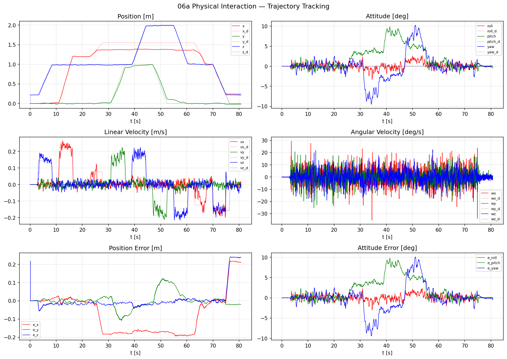 | 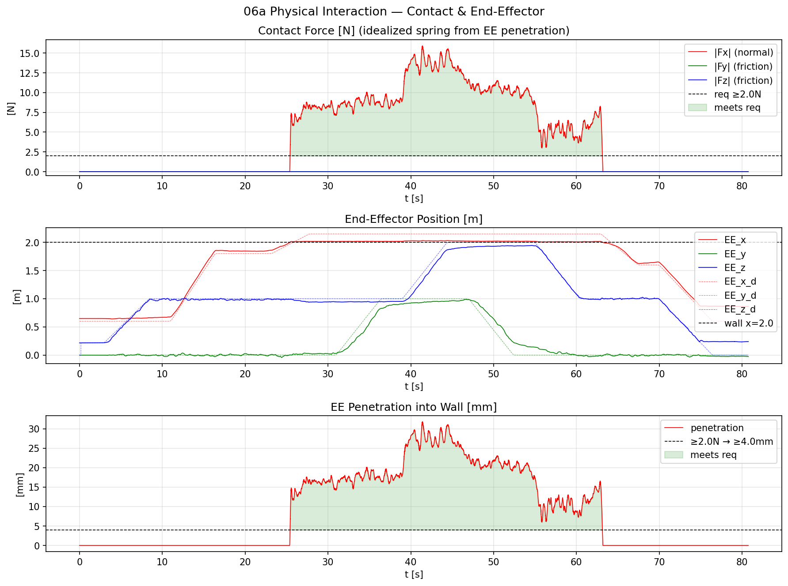 |

| Nominal vs admittance-filtered | Idealised external wrench |
|---|---|
| 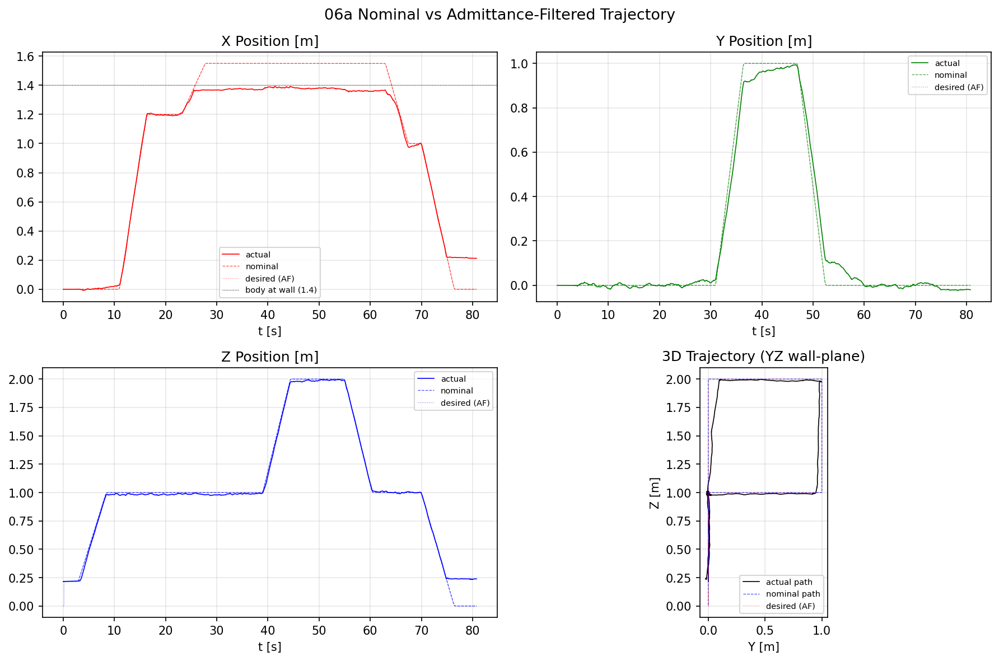 | 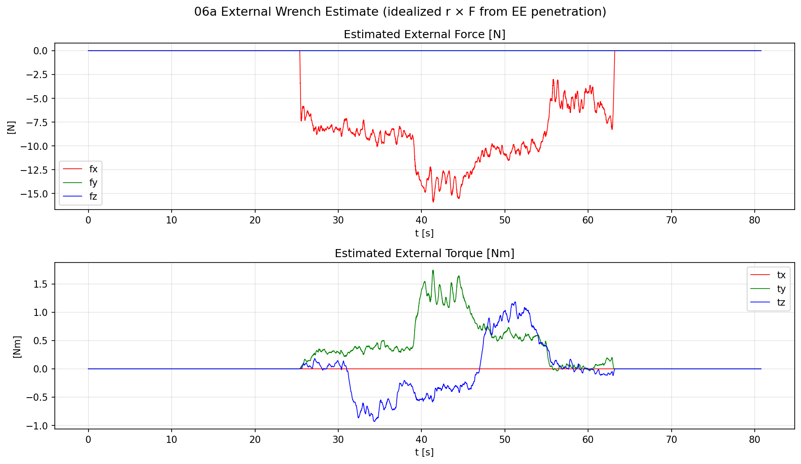 |

---

## Acknowledgments

This repository is the result of work I carried out as a student on the *Aerial Robotics Laboratory*
module of the *Advanced Topics in Automation and Control Engineering* course (a.y. 2025–26). All
intellectual credit for the lab design, the course material, the `tk3lab` Docker image, and the
`telekyb3` software framework belongs to:

- Dr. **Marco Tognon** - *Inria, RAINBOW Team*
- Dr. **Gianluca Corsini** - *Inria / Université de Rennes, RAINBOW Team*
- The original authors of `telekyb3` and its constituent GenoM3 components, in particular **Anthony
  Mallet** (LAAS-CNRS) and the maintainers at IRISA-Inria, the University of Twente, and University
  College London.

The wrench observer / admittance filter design follows:

> T. Tomić, C. Ott, and S. Haddadin, *"External Wrench Estimation, Collision Detection, and Reflex
> Reaction for Flying Robots"*, IEEE Trans. on Robotics, vol. 33, no. 6, pp. 1467–1482, Dec. 2017.
> ([DOI](https://doi.org/10.1109/TRO.2017.2750703))

The momentum-based torque observer is from:

> A. De Luca, A. Albu-Schäffer, S. Haddadin, and G. Hirzinger, *"Collision Detection and Safe
> Reaction with the DLR-III Lightweight Manipulator Arm"*, IROS 2006.

I claim authorship only over the Python clients in `src/`, the parameter tuning, the SDF additions
needed for assignment 6a (EE bar + thin wall world), and the plotting scripts.

---

## References

### Course material
- Course page (Politecnico di Milano): *055512 - Advanced Topics in Automation and Control Engineering*
- RAINBOW Team @ Inria: <https://team.inria.fr/rainbow/>

### Software
- `telekyb3`: <https://git.openrobots.org/projects/telekyb3>
- GenoM3: <https://www.openrobots.org/wiki/genom3>
- robotpkg: <http://robotpkg.openrobots.org/>
- Gazebo: <https://gazebosim.org/>
- SDFormat: <https://sdformat.org/>
- python-genomix: <https://git.openrobots.org/projects/genomix>

### GenoM3 components used here
Each link points at the up-to-date source/README. The version actually installed inside the `tk3lab`
Docker image may differ slightly; the offline doc shipped with the image at
`/opt/openrobots/share/doc/<component>-genom/README.html` is authoritative for the installed version.

- [`mrsim-gazebo`](https://git.openrobots.org/projects/mrsim-gazebo)
- [`optitrack-gazebo`](https://git.openrobots.org/projects/optitrack-gazebo)
- [`rotorcraft-genom3`](https://git.openrobots.org/projects/rotorcraft-genom3)
- [`pom-genom3`](https://git.openrobots.org/projects/pom-genom3)
- [`nhfc-genom3`](https://git.openrobots.org/projects/nhfc-genom3)
- [`uavpos-genom3`](https://git.openrobots.org/projects/uavpos-genom3)
- [`uavatt-genom3`](https://git.openrobots.org/projects/uavatt-genom3)
- [`maneuver-genom3`](https://git.openrobots.org/projects/maneuver-genom3)
- [`phynt-genom3`](https://git.openrobots.org/projects/phynt-genom3)
- [`optitrack-genom3`](https://git.openrobots.org/projects/optitrack-genom3)
